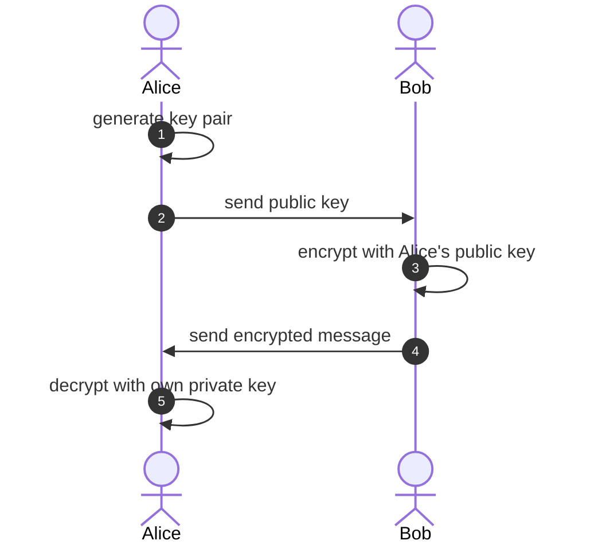
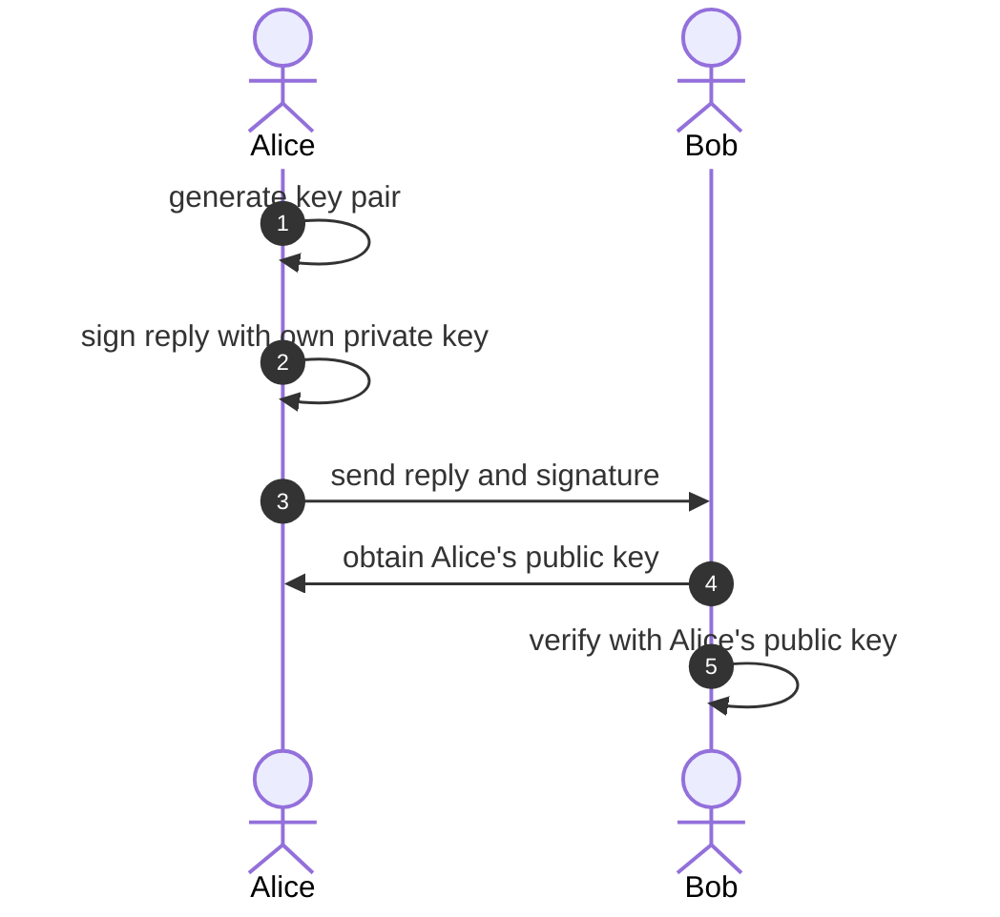

# Crypto

## Background

This project is inspired by [crypgo](https://gitlab.com/rahasak-labs/crypgo) from gitlab,
and the owner wrote a post, [RSA cryptography in Golang](https://medium.com/rahasak/golang-rsa-cryptography-1f1897ada311) about it.

After reading, I found the original code cannot encrypt long string which is over 117 byte length.
So I modified a little, split a long string into limit size and use segment encryption,
and differ with OAEP and PKCS encryption algorithm.

## Usage

**Scene 1: Bob sends Alice a secret instruction**

In this process, there are only 2 transmissions. The first time is for Alice to pass the public key to Bob,
and the second is for Bob to pass the encrypted message to Alice.
Even if they are intercepted by the enemy, there is no danger.
Because only Alice's private key Only the key can decrypt the message,
preventing the leakage of the message content.

**Scene 2: Alice receives the secret and reply 'OK'**

In this process, there are only 2 transmissions.
The first time is for Alice to deliver the signed message and the message itself to Bob,
and the second time is for Bob to obtain Alice's public key.
Even if they are all intercepted by the enemy, there is no danger.
Because only Alice's private key can sign the message, even if the content of the message is known,
it is impossible to forge a signed reply to Bob, which prevents the tampering of the message content.

However, combining the two scenarios, you will find that in the first scenario, although the intercepted message is not leaked,
the intercepted public key can be used to encrypt the fake instruction and then pass it to Alice.
In the second scenario, although the intercepted message cannot be tampered with,
the content of the message can be obtained by using the public key to verify the signature, which cannot prevent leakage.
Therefore, in practical applications, it should be used according to the situation,
and encryption and signature can also be used at the same time.
For example, both Alice and Bob have their own public and private keys.
When Alice wants to send a message to Bob, first use Bob's public key to pair The message is encrypted,
and then Alice's private key is used to sign the encrypted message,
so that it can neither be leaked nor tampered with, and the security of the message can be guaranteed.

## Structs

`Config` saves key pair file path and key size:

```go
type Config struct {
    DotKeys  string // DotKeys represents the parent dir of IDRsa and IDRsaPub
    IDRsa    string // IDRsa represents private key file
    IDRsaPub string // IDRsaPub represents public key file
    KeySize  int    // KeySize represents the bit size of key pair
}
```

`KeyPair` stores key pair object:

```go
type KeyPair struct {
    publicKey  *rsa.PublicKey
    privateKey *rsa.PrivateKey
}
```

## Functions

There are several helpful functions in this repo, eg:
- generates an RSA key pair of the given bit size: `GenerateKeyPair()`
- save keys to file: `SaveKeyPair()`
- read keys from file: `LoadKeyPair()`
- encrypt and decrypt:
  - with RSA and the padding scheme from PKCS #1 v1.5: `EncryptPKCS1v15()` and `DecryptPKCS1v15()`
  - with RSA-OAEP: `EncryptOAEP()` and `DecryptOAEP()`
- sign and validate:
  - using RSASSA-PKCS1-V1_5-SIGN from RSA PKCS #1 v1.5: `SignPKCS1v15()` and `VerifyPKCS1v15()`
  - using PSS: `SignPSS()` and `VerifyPSS()`

## Licenses

[Apache License Version 2.0](LICENSE)